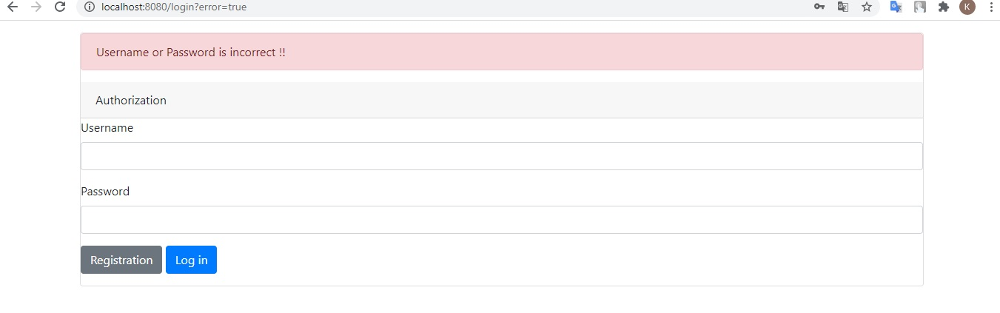
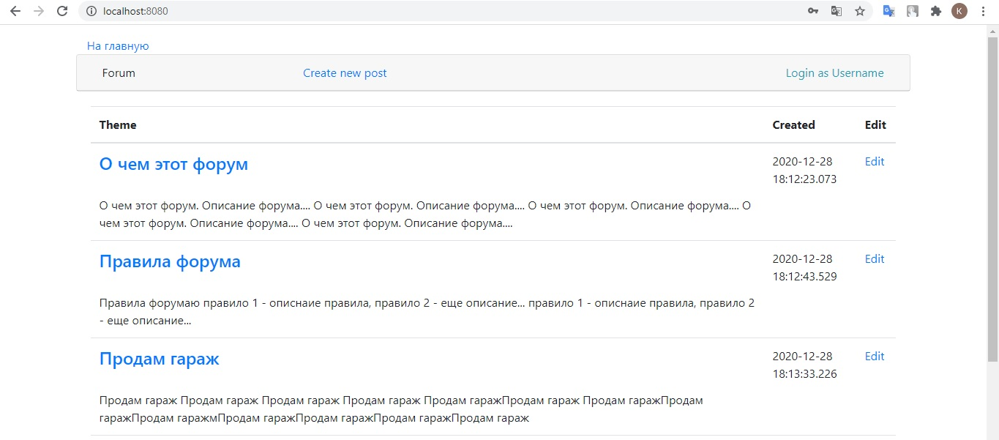
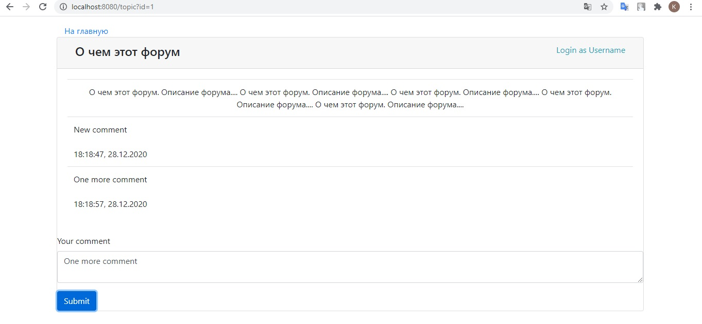

## Forum


Application has realized simple functional of forum. Contains itself registration page,authorization, page with posts and main page with topics.

Used technologies:
```
1.Spring (boot/security/data/mvc)
2.ORM Hibernate
3.Located on the cloud server Heroku (link: https://arcane-badlands-51939.herokuapp.com)
4.Maven as a build system
5.Front(jsp/js/bootstrap)
6.CI/CD Travis
```

Login page - the application implements registration and authentication of 
application users.:




A page with all forum topics and their brief description:





topic view page with the ability to add comments:

 



[](https://travis-ci.org/burovytsky/forum)
